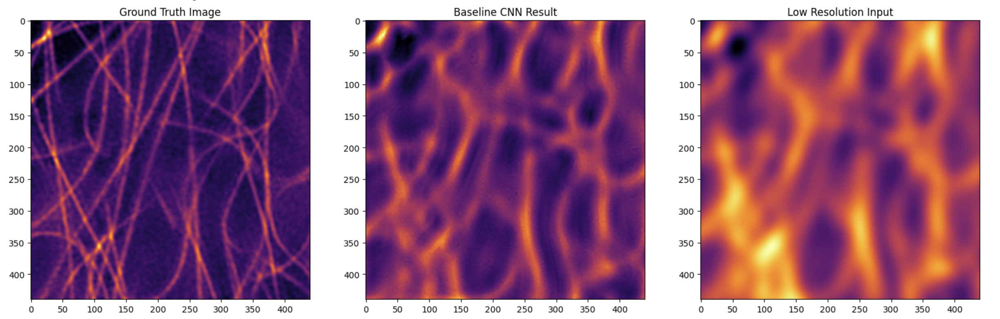

# Baseline Model

**[Notebook](baseline-CNN_model.ipynb)**

## Baseline Model Results

### Model Selection
- **Baseline Model Type:** Image prediction CNN based on Input images of Ground truth and low resolution images
- **Rationale:** A CNN was chosen as a simple type of model for image prediction 

### Model Performance
- **Evaluation Metric:**
- baseline CNN: MSE = 0.0054

### Evaluation Methodology
- **Visual Comparison of predicted Image with ground truth and low resolution images:**

## Next Steps
This baseline model serves as a reference point for evaluating more sophisticated models.
