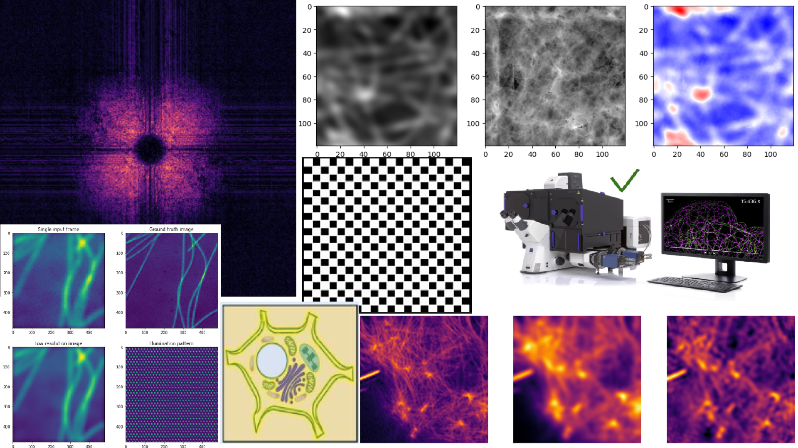

# Machine Learning for Medical Imaging in Super-Resolution Microscopy:
# Approaches to Cytological Image Reconstruction and Enhancement

## Repository Link

https://github.com/theDatascientista/ML-Microscpy_imaging_PINN

## Description

The idea of this project was based on the publication "Untrained, physics-informed neural networks for structured illumination microscopy" by Zachary Burns and Zhaowei Liu to train a PINN for a better microscopy image processing solution, regarding quality improvement and automation.

### Task Type

Creation of a Physics-informed neural network for microscopy imaging, based on partial differential equations related to image processing.

### Results Summary

| Model                                    | Loss                       | Comments      |
| :-------------                           | :-------------             | :-------------|
| CNN                                      | MSE = 0.0054               | 1000 Epochs   |
| Supervised                               | MSE = 0.ooo12              | 1500 Epochs   |
| Frequency Domain                         |  Frequency Loss = 0.080636 |  30 Epochs    |
| Frequency Domain (Combined with Spatial) |  Frequency Loss = 0.080636 | 111 Epochs    |

## Documentation

1. **[Literature Review](0_LiteratureReview/README.md)**
2. **[Dataset Characteristics](1_DatasetCharacteristics/README.md)**
3. **[Baseline Model](2_BaselineModel/baseline-CNN_model.ipynb)**
4. **[Model](3_Model)**
5. **[Presentation](4_Presentation/README.md)**

## Cover Image

